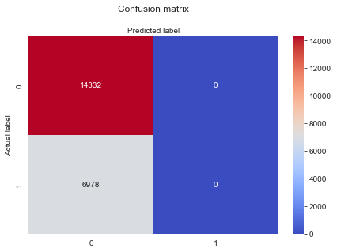

<h1> Summary of Machine Learning Model </h1>
<h2> Description</h2>

 The machine model used is the Random Forest classifier. This was used because the nature of the question asked, are we able to predict gold medal winners, involved classification & I achieved the best results with this model. I also tested neural networks, but had substantially less accurate results.

<h2> Preprocessing</h2>

 To prepare the data beyond what Stephenie has completed for deliverable 1, I created a new olympics_results dataframe in order to combine the hosts, game locations, countries, etc. I also merged country names (the various countries that now fall under Russia, Germany, and fixed an issue with the CSV where it combined Australia & Sweden). I wanted to give the classifier as many different variables as possible, since the stories of the winners are so inherentl diverse. From there, I converted the metal types from string (Gold, Silver, and Bronze) to integers (1, 2, 3). After that, I used one hot encoder to encode the rest of the string types. 

<h2> Interpretation of the model </h2>

 The accuracy of the model fell ~67%. While the results could be more accurate, the other model that I tested was ~32%, which this was a major improvement from. Due to the nature of the sheer volume of variables, I believe a 67% accuracy rating is acceptable. Also included is the confusion matrix for review of accuracy, precision, and sensitivity:

 